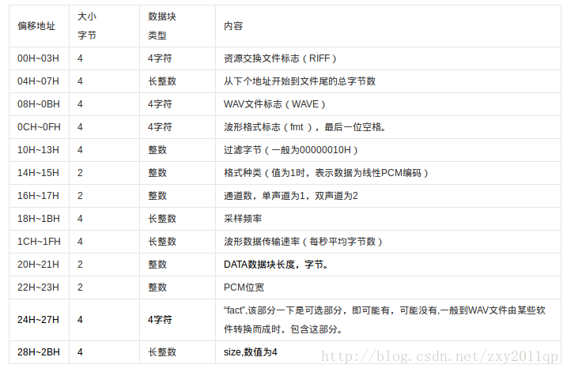
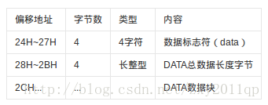

# C++和C读取WAV文件头的疑惑 #

很多时候我们要对音频进行处理，首先你要考虑的是读取音频信息。下面是百度百科得到wav文件头信息





今天要讨论的是上面红色圈圈部分，主要是c语言中读取文件头不需要一个过度4个字节，而c++需要。

C语言代码：

```
#include <stdio.h>
 
/*
read a  wav voice by c language
*/

typedef struct wave_tag
 
{
char ChunkID[4]; // "RIFF"标志
unsigned int ChunkSize; // 文件长度(WAVE文件的大小, 不含前8个字节)
char Format[4]; // "WAVE"标志
char SubChunk1ID[4]; // "fmt "标志
unsigned int SubChunk1Size; // 过渡字节(不定)
unsigned short int AudioFormat; // 格式类别(10H为PCM格式的声音数据)
unsigned short int NumChannels; // 通道数(单声道为1, 双声道为2)
unsigned short int SampleRate; // 采样率(每秒样本数), 表示每个通道的播放速度
unsigned int ByteRate; // 波形音频数据传输速率, 其值为:通道数*每秒数据位数*每样本的数据位数/8
unsigned short int BlockAlign; // 每样本的数据位数(按字节算), 其值为:通道数*每样本的数据位值/8
unsigned short int BitsPerSample; // 每样本的数据位数, 表示每个声道中各个样本的数据位数.
//char deathDate[4];
char SubChunk2ID[4]; // 数据标记"data"
unsigned int SubChunk2Size; // 语音数据的长度
} WAVE;

int main(int argc, char *argv[])
 
{
 
FILE *fp;
 
WAVE wav;
 
fp=fopen("./4.wav","rb"); 
 
fread(&wav, sizeof(struct wave_tag), 1, fp);
 
printf("ChunkID=%c %c %c %c\n",wav.ChunkID[0],wav.ChunkID[1],wav.ChunkID[2],wav.ChunkID[3]);
 
printf("ChunkSize=%d\n",wav.ChunkSize);
 
printf("Format=%c %c %c %c\n",wav.Format[0],wav.Format[1],wav.Format[2],wav.Format[3]);
 
printf("SubChunk1ID=%c %c %c %c\n",wav.SubChunk1ID[0],wav.SubChunk1ID[1],wav.SubChunk1ID[2],wav.SubChunk1ID[3]);
 
printf("SubChunk1Size=%d\n",wav.SubChunk1Size);
 
printf("AudioFormat=%d\n",wav.AudioFormat);
 
printf("NumChannels=%d\n",wav.NumChannels);
 
printf("SampleRate=%d\n",wav.SampleRate);
 
printf("ByteRate=%d\n",wav.ByteRate);
 
printf("BlockAlign=%d\n",wav.BlockAlign);
 
printf("BitsPerSample=%d\n",wav.BitsPerSample);
 
printf("SubChunk2ID=%c %c %c %c\n",wav.SubChunk2ID[0],wav.SubChunk2ID[1],wav.SubChunk2ID[2],wav.SubChunk2ID[3]);
 
printf("SubChunk2Size= %d\n",wav.SubChunk2Size);
 
return 0;
 
}
```

C++ 语言代码：

```
#include <iostream>
using namespace std;
#include <stdio.h>
/*
read a  wav voice by c++ language
*/
 
typedef struct wave_tag
{
	char ChunkID[4];					// "RIFF"标志
	unsigned int ChunkSize;		// 文件长度(WAVE文件的大小, 不含前8个字节)
	char Format[4];						// "WAVE"标志
	char SubChunk1ID[4];				// "fmt "标志
	unsigned int SubChunk1Size;	// 过渡字节(不定)
	unsigned short int AudioFormat;		// 格式类别(10H为PCM格式的声音数据)
	unsigned short int NumChannels;		// 通道数(单声道为1, 双声道为2)
	unsigned short int SampleRate;		// 采样率(每秒样本数), 表示每个通道的播放速度
	unsigned int ByteRate;			// 波形音频数据传输速率, 其值为:通道数*每秒数据位数*每样本的数据位数/8
	unsigned short int BlockAlign;		// 每样本的数据位数(按字节算), 其值为:通道数*每样本的数据位值/8
	unsigned short int BitsPerSample;	// 每样本的数据位数, 表示每个声道中各个样本的数据位数.
	char deathDate[4];
	char SubChunk2ID[4];				// 数据标记"data"
	unsigned int SubChunk2Size;	// 语音数据的长度
 
} WAVE;
 
int main(int argc, char *argv[])
{
	FILE *fp;
	WAVE wav;
	fp=fopen("./4.wav","rb"); 
	fread(&wav, sizeof(struct wave_tag), 1, fp);
	cout<<wav.ChunkID<<endl;					// "RIFF"标志
	cout<<wav.ChunkSize<<endl;		// 文件长度(WAVE文件的大小, 不含前8个字节)
	cout<<wav.Format<<endl;						// "WAVE"标志
	cout<<wav.SubChunk1ID<<endl;				// "fmt "标志
	cout<<wav.SubChunk1Size<<endl;	// 过渡字节(不定)
	cout<<wav.AudioFormat<<endl;		// 格式类别(10H为PCM格式的声音数据)
	cout<<wav.NumChannels<<endl;		// 通道数(单声道为1, 双声道为2)
	cout<<wav.SampleRate<<endl;		// 采样率(每秒样本数), 表示每个通道的播放速度
	cout<<wav.ByteRate<<endl;			// 波形音频数据传输速率, 其值为:通道数*每秒数据位数*每样本的数据位数/8
	cout<<wav.BlockAlign<<endl;		// 每样本的数据位数(按字节算), 其值为:通道数*每样本的数据位值/8
	cout<<wav.BitsPerSample<<endl;	// 每样本的数据位数, 表示每个声道中各个样本的数据位数.
	cout<<wav.deathDate<<endl;
	cout<<wav.SubChunk2ID<<endl;				// 数据标记"data"
	cout<<wav.SubChunk2Size<<endl;
	
	return 0;
}
```

测试了几个音频发现是音频的问题，有些音频在 WAV 文件头和 WAV 数据段之间是有 4 个空字节而有的没有，这个在实际处理中还需要多加注意。解决方法是判断一下音频是否有 4 个空字节，然后读取音频。

————————————————

版权声明：本文为CSDN博主「zxy2011qp」的原创文章，遵循CC 4.0 BY-SA版权协议，转载请附上原文出处链接及本声明。

原文链接：https://blog.csdn.net/zxy2011qp/article/details/37959311

