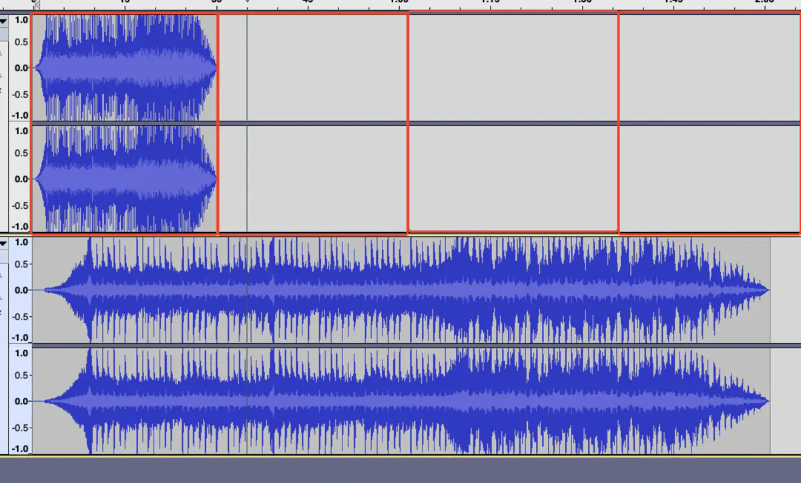
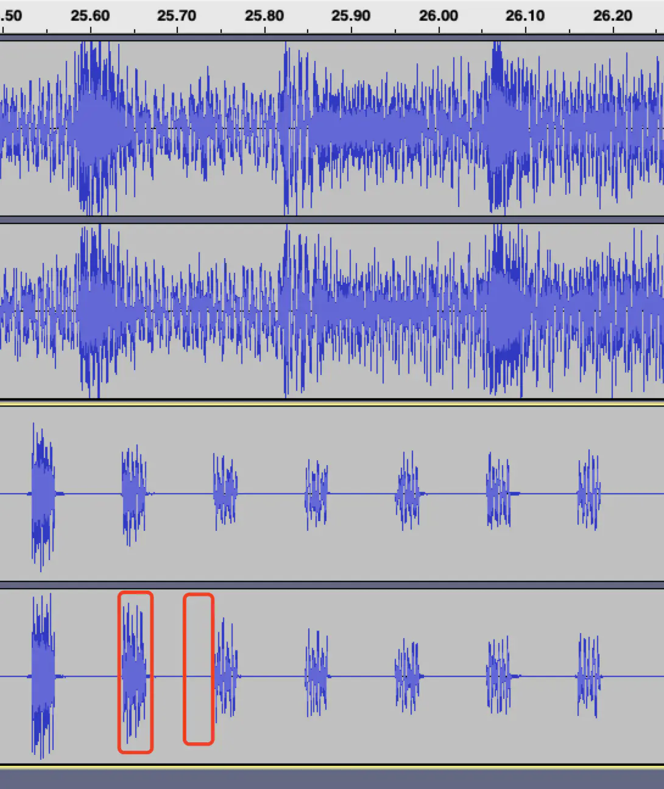

# libmp3lame的介绍和使用 #

## API介绍 ##

API地址是对libmp3lame.so的编码部分最基础接口的介绍，本库特包含了增加id3标签和mp3的解码的支持。这里并不是完整的文档，但是你可以通过查看"include/lame.h"找到他们，并且通过查看frontend/main.c看到部分编解码的源代码。

1.(可选) 如果你感兴趣，可以获取编码器的版本号.

	void get_lame_version(char *strbuf, size_t buflen, const char *prefix);

2.错误信息。

LAME默认情况下会使用vfprintf()将错误信息给stderr，在一些有界面的应用下，可能获取方面会有问题，所以支持你设置自己的错误信息Handlers：

	lame_set_errorf(gfp,error_handler_function);
	lame_set_debugf(gfp,error_handler_function);
	lame_set_msgf(gfp,error_handler_function);

可以通过查看lame.h找到更多的细节。

3.初始化编码器。

为所有的编码参数设置默认值。

```
#include "lame.h"
lame_global_flags *gfp;
gfp = lame_init();
```

默认情况（如果什么都没设置），输出格式为J-Stereo, 44.1khz 128kbps CBR quality=5，的mp3，如果需要可以调用代码重写下面的设置：

```
   lame_set_num_channels(gfp,2);
   lame_set_in_samplerate(gfp,44100);
   lame_set_brate(gfp,128);
   lame_set_mode(gfp,1);
   lame_set_quality(gfp,2);   /* 2=high  5 = medium  7=low */ 
```

可以查看lame.h获取所有的可以调用的API列表。需要注意的是有很多lame_set_*()并没有在lame.h里，这些功能是试验性的仅仅用来测试，可能在后续的版本中移除。

4.设置编码参数

调用下面的代码来设置上面设置的不同的设置，返回ret_code >= 0表明设置成功。

	ret_code = lame_init_params(gfp);

5.编码逻辑

输入pcm数据，输出MP3帧，lame_encode_buffer会完成所有所需的缓冲,重采样,过滤操作。需要的mp3buffer_size参数可以通过num_samples, samplerate和encoding rate计算出来，这里有一个最坏情况的估算：

	mp3buffer_size (in bytes) = 1.25 * num_samples + 7200

num_samples为PCM每个channel包含的采样数量，不是L通道和R通道中样本数量的总和，也就是单个channel的采样数量。
返回值为mp3buffer中包含的byte的数量，可以为0，如果是负值说明发生了错误。

```
   int lame_encode_buffer(lame_global_flags *gfp,
         short int leftpcm[], short int rightpcm[],
         int num_samples,char *mp3buffer,int  mp3buffer_size);
```

还有用于各种类型输入的例子(float, long, interleaved等等)，具体可以查看lame.h.

6.flush清空缓存

lame_encode_flush将刷新缓冲区并可能返回最后几个mp3帧，mp3buffer应该至少有7200 bytes，返回值同样是输出到mp3buffer的数量，可以为0.

	int lame_encode_flush(lame_global_flags *,char *mp3buffer, int mp3buffer_size);

7.向mp3文件中写入Xing VBR/INFO标签

	void lame_mp3_tags_fid(lame_global_flags *,FILE* fid);

这将添加一个有效的mp3帧，其中包含关于比特流有些音乐播放器可能会觉得有用。用于CBR,ABR和VBR。将尝试回到输出流的开头并写入标签，但有可能会失败，(比如，输出到了其他地方)，这时候就需要在上面的步骤3之前调用lame_set_bWriteVbrTag(gfp,0),并且调用lame_mp3_tags_fid() with fid=NULL,如果尝试回到开头失败比特流的第一个mp3帧都是0。

8.释放内部数据结构体

	void lame_close(lame_global_flags *); 

## 简单使用 ##

其实API的介绍已经把用法说的很清楚了，除了第一第二步，顺着走下来就好了。
这里感觉没有什么好说的，写我在用它的时候遇到的问题吧。
编码结束之后发现MP3时长变成了源音频的4倍，使用Audacity查看如图所示：



并且放大之后发现每一帧后面都是空的，只有前面的小部分是有效的。



查看之后其实最主要的就是 lame_encode_buffer_interleaved的调用:

```
int lame_encode_buffer_interleaved(lame_global_flags * gfp,
                               short int pcm[], int nsamples,
                               unsigned char *mp3buf, int mp3buf_size)
```

看他的参数，两个要注意的点:

1. 他需要的是short int pcm[]，在准备数据的时候如果是用了uint8_t或者char之类的作为容器的话，需要注意size需要除以二，变成short int的size.
1. nsamples的参数理解，是单个channel含有的short int类型数据的size。如果输入源是双声道的uint8_t数组，那就需要除以四。

代码查看[Mp3Lame.cpp](./images/Mp3Lame.cpp)

音视频相关


作者：YocnZhao

链接：https://www.jianshu.com/p/f4fc24ee0bb0

来源：简书

著作权归作者所有。商业转载请联系作者获得授权，非商业转载请注明出处。