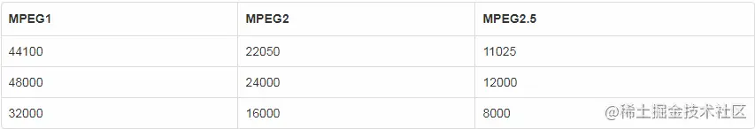
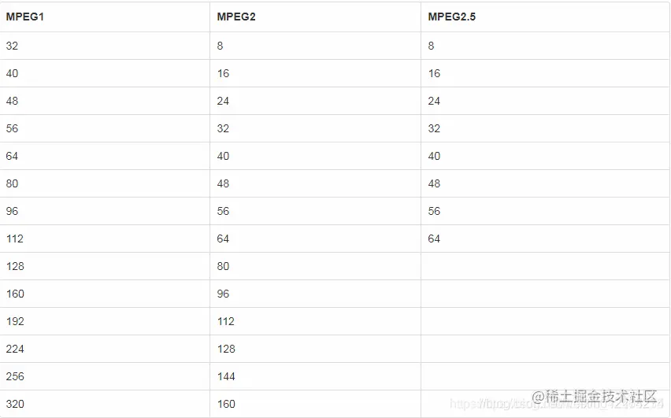

# linux下lame&alsa进行音频流操作（一）lame知识介绍

# 1.LAME介绍

  lame是一个有名的开源mp3编码库，这篇文章将会介绍如何调用lame库的接口编码出mp3。

# 2.lame库编译

  对于lame库，你有两个安装的方法，第一是使用apt-get安装，使用下面的命令。

```bash
sudo apt-get install libmp3lame-dev
复制代码
```

  这样安装的lame库可能并不是最新版本的。如果你想安装最新版本的lame库，可以选择在官网下载。

1. 官网下载：[sourceforge.net/projects/la…](https://link.juejin.cn?target=https%3A%2F%2Fsourceforge.net%2Fprojects%2Flame%2Ffiles%2Flame%2F)
2. gitx下载：

```bash
wget https://nchc.dl.sourceforge.net/project/lame/lame/3.100/lame-3.100.tar.gz
复制代码
```

1. 交叉编译

```bash
cd   lame-3.100
mkdir  _install
./configure --host=csky-linux  --prefix=xxx/lame-3.100/_install
make
make install
复制代码
```

  按照上序流程依次执行，arm-linux为交叉编译工具链，根据编译条件修改，最后在/lame-3.100/_install生成目标文件

# 3.MP3的介绍

1. **mp3（MPEG Layer III）** :这种格式在生活中很常见，但是mp3有很多种参数，这里讨论一下mp3编码所必须知道的一些参数。
2. **采样率（sampleRate）**：采样率越高声音的还原度越好。
3. **比特率（bitrate）**：每秒钟的数据量，越高音质越好。
4. **声道数（channels）**：声道的数量，通常只有单声道和双声道，双声道即所谓的立体声。 比特率控制模式：ABR、VBR、CBR，这3中模式含义很容易查询到，不在赘述。

# 4.MPEG Layer III

   MPEG有几个版本的协议，不同版本的协议能够支持的参数能力是不同的。编码库的使用者必须清楚不同版本的区别才能正确的设置参数。

  有以下3个版本的协议，MPEG1、MPEG2、MPEG2.5。其中MPEG2.5是非官方的标准，但是流传广泛，所以基本也都支持。他们的区别主要集中在支持的比特率和采样率不同。

## 4.1 采样率支持(Hz)



## 4.2 比特率支持(bit/s)



# 5.编码流程

  使用lame库只需要包含lame.h头文件，编码mp3基本上遵循以下的流程:

## 5.1 初始化编码参数

```
  lame_init：初始化一个编码参数的数据结构，给使用者用来设置参数。
```

## 5.2 设置编码参数

`lame_set_in_samplerate：设置被输入编码器的原始数据的采样率。` `lame_set_out_samplerate：设置最终mp3编码输出的声音的采样率，如果不设置则和输入采样率一样。` `lame_set_num_channels ：设置被输入编码器的原始数据的声道数。` `lame_set_mode ：设置最终mp3编码输出的声道模式，如果不设置则和输入声道数一样。参数是枚举，STEREO代表双声道，MONO代表单声道。` `lame_set_VBR：设置比特率控制模式，默认是CBR，但是通常我们都会设置VBR。参数是枚举，vbr_off代表CBR，vbr_abr代表ABR（因为ABR不常见，所以本文不对ABR做讲解）vbr_mtrh代表VBR。` `lame_set_brate：设置CBR的比特率，只有在CBR模式下才生效。` `lame_set_VBR_mean_bitrate_kbps：设置VBR的比特率，只有在VBR模式下才生效。` 其中每个参数都有默认的配置，如非必要可以不设置。这里只介绍了几个关键的设置接口，还有其他的设置接口可以参考lame.h（lame的文档里只有命令行程序的用法，没有库接口的用法）。

## 5.3 初始化编码器

```
lame_init_params：根据上面设置好的参数建立编码器
```

## 5.4 编码PCM数据

`lame_encode_buffer或lame_encode_buffer_interleaved：将PCM数据送入编码器，获取编码出的mp3数据。这些数据写入文件就是mp3文件。`  其中lame_encode_buffer输入的参数中是双声道的数据分别输入的，lame_encode_buffer_interleaved输入的参数中双声道数据是交错在一起输入的。具体使用哪个需要看采集到的数据是哪种格式的，不过现在的设备采集到的数据大部分都是双声道数据是交错在一起。  单声道输入只能使用lame_encode_buffer，把单声道数据当成左声道数据传入，右声道传NULL即可。  调用这两个函数时需要传入一块内存来获取编码器出的数据，这块内存的大小lame给出了一种建议的计算方式：采样率/20+7200。

## 5.5 结束编码

```
lame_encode_flush：结束编码，获取编码出的结束数据。这部分数据也需要写入mp3文件。
```

## 5.6 销毁编码器

```
lame_close销毁编码器，释放资源。
```

# 6.示例代码

## 6.1 wav转mp3示例程序代码

```cpp
/*
gcc -I /usr/include/lame/ lame_test.c -lmp3lame -o lame_test -lm
*/
#include <stdio.h>
#include <stdlib.h>
#include <lame.h>
 
#define INBUFSIZE 4096
#define MP3BUFSIZE (int) (1.25 * INBUFSIZE) + 7200
 
int encode(char* inPath, char* outPath)
{
        int status = 0;
        lame_global_flags* gfp;
        int ret_code;
        FILE* infp;
        FILE* outfp;
        short* input_buffer;
        int input_samples;
        char* mp3_buffer;
        int mp3_bytes;
 
        gfp = lame_init();
        if (gfp == NULL) 
        {
                printf("lame_init failed/n");
                status = -1;
                goto exit;
        }
 
        ret_code = lame_init_params(gfp);
        if (ret_code < 0) 
        {
                printf("lame_init_params returned %d/n",ret_code);
                status = -1;
                goto close_lame;
        }
 
        infp = fopen(inPath, "rb");
        outfp = fopen(outPath, "wb");
 
        input_buffer = (short*)malloc(INBUFSIZE*2);
        mp3_buffer = (char*)malloc(MP3BUFSIZE);
 
        do
        {
                input_samples = fread(input_buffer, 2, INBUFSIZE, infp);
                //fprintf(stderr, "input_samples is %d./n", input_samples);
                mp3_bytes = lame_encode_buffer_interleaved(gfp, input_buffer,input_samples/2,mp3_buffer, MP3BUFSIZE);
                //fprintf(stderr, "mp3_bytes is %d./n", mp3_bytes);
                if (mp3_bytes < 0)
                {
                        printf("lame_encode_buffer_interleaved returned %d/n", mp3_bytes);
                        status = -1;
                        goto free_buffers;
                } 
                else if(mp3_bytes > 0)
                {
                        fwrite(mp3_buffer, 1, mp3_bytes, outfp);
                }
        }while (input_samples == INBUFSIZE);
 
        mp3_bytes = lame_encode_flush(gfp, mp3_buffer, sizeof(mp3_buffer));
        if (mp3_bytes > 0) 
        {
                printf("writing %d mp3 bytes/n", mp3_bytes);
                fwrite(mp3_buffer, 1, mp3_bytes, outfp);
        }
        free_buffers:
        free(mp3_buffer);
        free(input_buffer);
 
        fclose(outfp);
        fclose(infp);
        close_lame:
        lame_close(gfp);
        exit:
        return status;
}
int main(int argc, char** argv) 
{
        if (argc < 3) 
        {
                printf("usage: lame_test rawinfile mp3outfile/n");
        }
        encode(argv[1], argv[2]);
        return 0;
}

复制代码
```

## 6.2 录音转MP3格式程序代码

```cpp
/*
gcc -I /usr/include/lame/ -lmp3lame -o mp3_record mp3_record.c -lm
*/
#include <stdio.h>
#include <stdlib.h>
#include <unistd.h>
#include <fcntl.h>
#include <errno.h>
#include <signal.h>
#include <sys/ioctl.h>
#include <memory.h>
#include <linux/soundcard.h>
 
#include "lame.h"
 
#define BUFF_SIZE 512
#define INBUFF_SIZE 4096
#define MP3BUFF_SIZE (int) (1.25 * INBUFF_SIZE) + 7200
 
static int run=1;
 
static void stop(int signum)
{
        fprintf(stderr, "exit/n");
        run=0;
}
 
int SetFormat(int fd, unsigned int bit, unsigned int channel, unsigned int hz)
{
        int ioctl_val;
 
        /* set bit format */
        ioctl_val = bit;
        if(ioctl(fd, SNDCTL_DSP_SETFMT, &ioctl_val) < 0)
        {
                fprintf(stderr, "Set fmt to bit %d failed:%s/n", bit, strerror(errno));
                return -1;
        }
        if (ioctl_val != bit) 
        {
                fprintf(stderr, "do not support bit %d, supported %d/n", bit,ioctl_val);
                return (-1);
        }
 
        /*set channel */
        ioctl_val = channel;
        if ((ioctl(fd, SNDCTL_DSP_CHANNELS, &ioctl_val)) == -1)
        {
                fprintf(stderr, "Set Audio Channels %d failed:%s/n", channel, strerror(errno));
                return (-1);
        }
        if (ioctl_val != channel)
        {
                fprintf(stderr, "do not support channel %d,supported %d/n", channel, ioctl_val);
                return (-1);
        }
 
        /*set speed */
        ioctl_val = hz;
        if (ioctl(fd, SNDCTL_DSP_SPEED, &ioctl_val) == -1) 
        {
                fprintf(stderr, "Set speed to %d failed:%s/n", hz, strerror(errno));
                return (-1);
        }
        if (ioctl_val != hz) 
        {
                fprintf(stderr, "do not support speed %d,supported is %d/n", hz,ioctl_val);
                return (-1);
        }
 
        return 0;
}
 
int main(int argc, char **argv)
{
        int status =0;
        int snd_f;
        int fd_f;
        lame_global_flags* gfp;
        short *input_buff;
        char *mp3_buff;
 
        if(argc !=2)
        {
                fprintf(stderr, "useage: ./mp3_record test.mp3/n");
                return -1;
        }
        signal(SIGINT,stop);
 
        if((snd_f = open("/dev/dsp", O_RDONLY)) < 0)
        {
                fprintf(stderr, "open audio device error: %s", strerror(errno));
                status = -1;
                goto exit;
        }
 
        if((fd_f = open(argv[1], O_CREAT | O_WRONLY)) < 0)
        {
                fprintf(stderr, "open file error: %s", strerror(errno));
                status = -1;
                goto exit;
        }
 
        if (SetFormat(snd_f, 16, 2, 44100) < 0)
        {
                fprintf(stderr, "cannot set /dev/dsp in bit 16, channel 2, speed 44100/n");
                status = -1;
                goto exit;
        }
 
        gfp = lame_init();
        if (gfp == NULL) 
        {
                printf("lame_init failed/n");
                status = -1;
                goto exit;
        }
 
        int ret_code = lame_init_params(gfp);
        if (ret_code < 0)
        {
                printf("lame_init_params returned %d/n",ret_code);
                status = -1;
                goto close_lame;
        }
 
        input_buff = (short *)malloc(INBUFF_SIZE*2);
        mp3_buff = (char *)malloc(MP3BUFF_SIZE);
 
        int samples;
        int mp3_bytes;
        int write_bytes;
        int n=100;
        while(run)
        {
                //while(n>0){
                //n--;
                //fprintf(stderr, "n is %d./n", n);
                memset(input_buff, 0 , INBUFF_SIZE*2);
                memset(mp3_buff, 0 , MP3BUFF_SIZE);
                samples = read(snd_f, input_buff, INBUFF_SIZE*2);
                if (samples < 0)
                {
                        perror("read sound device failed");
                        status = -1;
                        goto free_buffers;
                }
                // fprintf(stderr, "samples is %d./n", samples);
                mp3_bytes = lame_encode_buffer_interleaved(gfp, input_buff, samples/4, mp3_buff, MP3BUFF_SIZE);
                //fprintf(stderr, "mp3_bytes is %d./n", mp3_bytes);
                if (mp3_bytes < 0)
                {
                        printf("lame_encode_buffer_interleaved returned %d/n", mp3_bytes);
                        status = -1;
                        goto free_buffers;
                }
                write_bytes = write(fd_f, mp3_buff, mp3_bytes);
                //fprintf(stderr, "write_bytes is %d./n", write_bytes);
                if(write_bytes < 0)
                {
                        perror("write sound data file failed");
                        status = -1;
                        goto free_buffers;
                }
        }
 
        mp3_bytes = lame_encode_flush(gfp, mp3_buff, sizeof(mp3_buff));
        if (mp3_bytes > 0)
        {
                fprintf(stderr, "writing %d mp3 bytes/n", mp3_bytes);
                if(write(fd_f, mp3_buff, mp3_bytes) <0)
                fprintf(stderr, "'writing mp3 bytes error/n");
        }
        else
        {
                fprintf(stderr, "writing mp3 bytes 0/n");
        }
        free_buffers:
        free(mp3_buff);
        mp3_buff = NULL;
        free(input_buff);
        input_buff = NULL;
 
        close(snd_f);
        close(fd_f);
        close_lame:
        lame_close(gfp);
        exit:
        return status;
}
```

作者：RichardoMu
链接：https://juejin.cn/post/7182425510339674173
来源：稀土掘金
著作权归作者所有。商业转载请联系作者获得授权，非商业转载请注明出处。