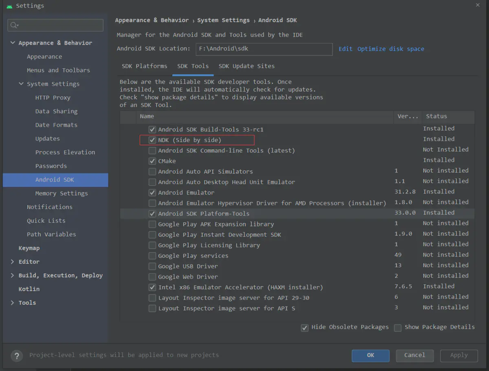
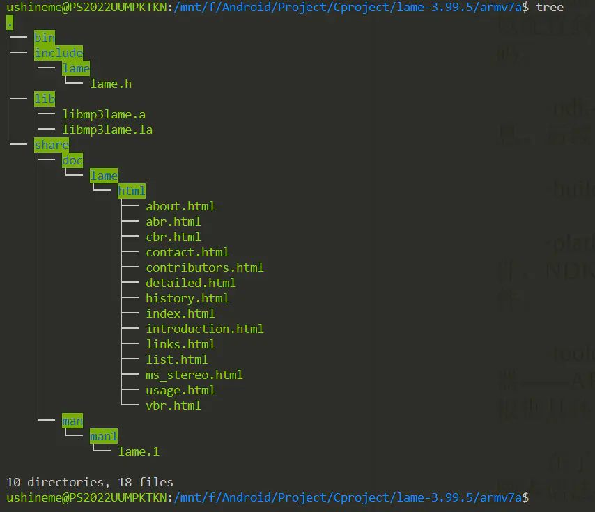

# windows平台使用wsl为Android编译lame

## lame

lame是非常优秀的一种MP3编码引擎，在业界，转码成MP3 格式的音频文件时，最常用的编码器就是lame库。

## wsl

Windows Subsystem for Linux（简称wsl)，适用于 Linux 的 Windows 子系统可让开发人员按原样运行 GNU/Linux 环境 - 包括大多数命令行工具、实用工具和应用程序 - 且不会产生传统虚拟机或双启动设置开销。  
安装可以看[windows 10安装wsl](https://www.jianshu.com/p/0028a182b29b)

## 1. 使用Android Studio下载ndk



下载ndk.png

## 2. 下载lame

```ruby
https://sourceforge.net/projects/lame/files/lame/
```

## 3. 在lame根目录下新建一个shell脚本配置各种变量并编译

```bash
#!/bin/bash
NDK_ROOT=/mnt/f/Android/Sdk/ndk/21.4.7075529
PREBUILT=$NDK_ROOT/toolchains/arm-linux-androideabi-4.9/prebuilt/windows-x86_64
PLATFORM=$NDK_ROOT/platforms/android-30/arch-arm
export PATH=$PATH:PREBUILT/bin:$PLATFORM/usr/include:
export LDFLAGS="-L$PLATFORM/usr/lib -L$PREBUILT/arm-linux-androideabi/lib -march=armv7-a"
export CFLAGS="-I$PLATFORM/usr/include -march=armv7-a -mfloat-abi=softfp -mfpu=vfp -ffast-math -O2"
export CPPFLAGS="$CFLAGS"
export CFLAGS="$CFLAGS"
export CXXFLAGS="$CFLAGS"
export LDFLAGS="$LDFLAGS"
export AS=$PREBUILT/bin/arm-linux-androideabi-as
export LD=$PREBUILT/bin/arm-linux-androideabi-ld
export CXX="$PREBUILT/bin/arm-linux-androideabi-g++ --sysroot=${PLATFORM}"
export CC="$PREBUILT/bin/arm-linux-androideabi-gcc --sysroot=${PLATFORM} -march=armv7-a "
export NM=$PREBUILT/bin/arm-linux-androideabi-nm
export STRIP=$PREBUILT/bin/arm-linux-androideabi-strip
export RANLIB=$PREBUILT/bin/arm-linux-androideabi-ranlib
export AR=$PREBUILT/bin/arm-linux-androideabi-ar
./configure --host=x86_64-linux\
--disable-shared\
--disable-frontend\
--enable-static\
--prefix=/mnt/f/Android/Project/Cproject/lame-3.99.5/armv7a
make clean
make -j8
make install
```

## 4. 在armv7a文件下可以看到编译结果



lame交叉编译完成.png

作者：ushineme  

链接：https://www.jianshu.com/p/3a7cbc59ff25  

来源：简书  

著作权归作者所有。商业转载请联系作者获得授权，非商业转载请注明出处。